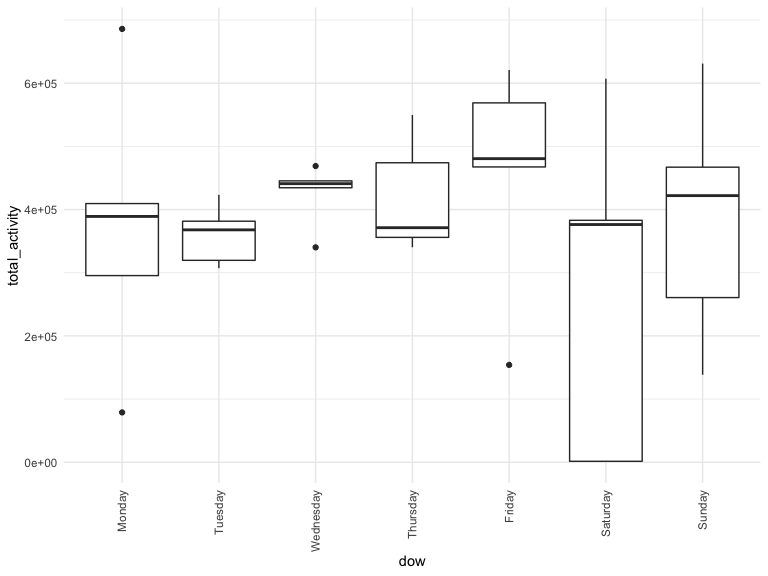
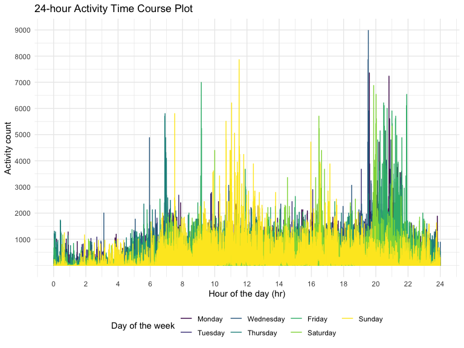

P8105 HW3
================
Elaine Yanxi Chen
2022-10-15

## Packages and settings

First we load the packages necessary to knit this document.

``` r
library(tidyverse)
library(ggridges)
library(patchwork)

library(p8105.datasets)

knitr::opts_chunk$set(
    echo = TRUE,
    warning = FALSE,
    fig.width = 8, 
  fig.height = 6,
  out.width = "90%"
)

theme_set(theme_minimal() + theme(legend.position = "bottom"))

options(
  ggplot2.continuous.colour = "viridis",
  ggplot2.continuous.fill = "viridis"
)

scale_colour_discrete = scale_colour_viridis_d
scale_fill_discrete = scale_fill_viridis_d
```

# Problem 1: `instacart`

## Import data

``` r
data("instacart")
```

## Describe the dataset

-   This dataset contains 1384617 rows and 15 columns, with each row
    representing a single product from an instacart order.

-   Variables include identifiers for user, order, and product; the
    order in which each product was added to the cart. There are several
    order-level variables, describing the day and time of the order, and
    number of days since prior order. Then there are several
    item-specific variables, describing the product name (e.g. Yogurt,
    Avocado), department (e.g. dairy and eggs, produce), and aisle
    (e.g. yogurt, fresh fruits), and whether the item has been ordered
    by this user in the past.

-   In total, there are 39123 products found in 131209 orders from
    131209 distinct users.

## Answer questions

-   How many aisles are there, and which aisles are the most items
    ordered from?

``` r
instacart %>% 
  count(aisle) %>% 
  arrange(desc(n))
```

    ## # A tibble: 134 × 2
    ##    aisle                              n
    ##    <chr>                          <int>
    ##  1 fresh vegetables              150609
    ##  2 fresh fruits                  150473
    ##  3 packaged vegetables fruits     78493
    ##  4 yogurt                         55240
    ##  5 packaged cheese                41699
    ##  6 water seltzer sparkling water  36617
    ##  7 milk                           32644
    ##  8 chips pretzels                 31269
    ##  9 soy lactosefree                26240
    ## 10 bread                          23635
    ## # … with 124 more rows

There are 134 aisles, and the most items are ordered from the fresh
vegetables and fresh fruits aisles.

-   Make a plot that shows the number of items ordered in each aisle,
    limiting this to aisles with more than 10000 items ordered. Arrange
    aisles sensibly, and organize your plot so others can read it.

``` r
instacart %>% 
   count(aisle) %>% 
  filter(n > 10000) %>% 
  mutate(aisle = fct_reorder(aisle, n)) %>% 
  ggplot(aes(x = aisle, y = n)) +
  geom_point() + 
  labs(title = "Number of items ordered in each aisle") +
  theme(axis.text.x = element_text(angle = 60, hjust = 1))
```


-   Make a table showing the three most popular items in each of the
    aisles “baking ingredients”, “dog food care”, and “packaged
    vegetables fruits”. Include the number of times each item is ordered
    in your table.

``` r
instacart %>% 
  filter(aisle == c("baking ingredients", "dog food care", "packaged vegetables fruits")) %>% 
  group_by(aisle) %>% 
  count(product_name) %>% 
  mutate(rank = min_rank(desc(n))) %>% 
  filter(rank < 4) %>% 
  arrange(desc(n)) %>% 
  knitr::kable()
```

| aisle                      | product_name                                    |    n | rank |
|:---------------------------|:------------------------------------------------|-----:|-----:|
| packaged vegetables fruits | Organic Baby Spinach                            | 3324 |    1 |
| packaged vegetables fruits | Organic Raspberries                             | 1920 |    2 |
| packaged vegetables fruits | Organic Blueberries                             | 1692 |    3 |
| baking ingredients         | Light Brown Sugar                               |  157 |    1 |
| baking ingredients         | Pure Baking Soda                                |  140 |    2 |
| baking ingredients         | Organic Vanilla Extract                         |  122 |    3 |
| dog food care              | Organix Grain Free Chicken & Vegetable Dog Food |   14 |    1 |
| dog food care              | Organix Chicken & Brown Rice Recipe             |   13 |    2 |
| dog food care              | Original Dry Dog                                |    9 |    3 |

-   Make a table showing the mean hour of the day at which Pink Lady
    Apples and Coffee Ice Cream are ordered on each day of the week;
    format this table for human readers (i.e. produce a 2 x 7 table).

``` r
instacart %>% 
  filter(product_id == c(3798, 17334)) %>% 
  group_by(product_name, order_dow) %>% 
  summarize(mean_hour = mean(order_hour_of_day)) %>% 
  spread(key = order_dow, value = mean_hour) %>%
  knitr::kable(digits = 2)
```

    ## `summarise()` has grouped output by 'product_name'. You can override using the
    ## `.groups` argument.

| product_name     |     0 |     1 |     2 |     3 |     4 |     5 |     6 |
|:-----------------|------:|------:|------:|------:|------:|------:|------:|
| Coffee Ice Cream | 13.22 | 15.00 | 15.33 | 15.40 | 15.17 | 10.33 | 12.35 |
| Pink Lady Apples | 12.25 | 11.68 | 12.00 | 13.94 | 11.91 | 13.87 | 11.56 |

Note that there are two names: Pink Lady Apples and Pink Lady (Cripps)
Apples. Not sure if they are the same product, but they do have
different `product_id`, so will use that to filter (both give the same
tibble).

# Problem 2: Accelerometer

## Import and tidy data

``` r
accel_data = read_csv(file = "./data/accel_data.csv") %>% 
  janitor::clean_names()
```

    ## Rows: 35 Columns: 1443
    ## ── Column specification ────────────────────────────────────────────────────────
    ## Delimiter: ","
    ## chr    (1): day
    ## dbl (1442): week, day_id, activity.1, activity.2, activity.3, activity.4, ac...
    ## 
    ## ℹ Use `spec()` to retrieve the full column specification for this data.
    ## ℹ Specify the column types or set `show_col_types = FALSE` to quiet this message.

``` r
accel_df = accel_data %>% 
  pivot_longer(
    activity_1:activity_1440,
    names_to = "min_of_day",
    values_to = "activity_count",
    names_prefix = "activity_"
  ) %>% 
  rename(dow = day) %>% 
  mutate(weekend = case_when(
    dow %in% c("Saturday", "Sunday") ~ "weekend",
    dow != c("Saturday", "Sunday") ~ "weekday",
    TRUE ~""
  ),
  min_of_day = as.numeric(min_of_day))
```

-   Load, tidy, and otherwise wrangle the data.

    -   Dataset was transformed using `pivot_longer` so that each row
        represents the activity count for a single minute in a 24-hour
        day.

-   Include all originally observed variables and values.

-   Include a weekday vs weekend variable.

-   Encode data with reasonable variable classes.

    -   `day` and `weekend` are coded as characters, while the rest of
        the variables are coded as numeric.

## Describe the data

Describe the resulting dataset (e.g. what variables exist, how many
observations, etc).

-   This dataset contains 50400 rows and 6 columns, with each row
    representing the activity count for a single minute in a 24-hour day
    for the 63-year-old male.

-   Variables include identifiers for the day, the minute, and the
    corresponding activity count. There are several day-level variables,
    describing which day (`day_id`)or which week (`week`) the activity
    count is from, out of the five week data collection period. It also
    describes which day of the week the measurement was from (`dow`) and
    whether it’s a weekday or a weekend (`weekend`). And then there is
    the minute-specific variable (`min_of_day`) that specifies the
    minute of the activity count measurement, starting at midnight of a
    24-hour day. Finally, we have the activity count (`activit_count`)
    measured by the accelerometers for each specific minute.

-   In total, there are activity counts from 1440 minutes each day for a
    total of 35 days spanning 5 weeks.

## Total activity over the day

We want to aggregate across minutes to create a total activity variable
for each day and show results in a table.

``` r
accel_df %>% group_by(week, day_id, dow, weekend) %>% summarize(total_activity = sum(activity_count)) %>% 
  knitr::kable()
```

    ## `summarise()` has grouped output by 'week', 'day_id', 'dow'. You can override
    ## using the `.groups` argument.

| week | day_id | dow       | weekend | total_activity |
|-----:|-------:|:----------|:--------|---------------:|
|    1 |      1 | Friday    | weekday |      480542.62 |
|    1 |      2 | Monday    | weekday |       78828.07 |
|    1 |      3 | Saturday  | weekend |      376254.00 |
|    1 |      4 | Sunday    | weekend |      631105.00 |
|    1 |      5 | Thursday  | weekday |      355923.64 |
|    1 |      6 | Tuesday   | weekday |      307094.24 |
|    1 |      7 | Wednesday | weekday |      340115.01 |
|    2 |      8 | Friday    | weekday |      568839.00 |
|    2 |      9 | Monday    | weekday |      295431.00 |
|    2 |     10 | Saturday  | weekend |      607175.00 |
|    2 |     11 | Sunday    | weekend |      422018.00 |
|    2 |     12 | Thursday  | weekday |      474048.00 |
|    2 |     13 | Tuesday   | weekday |      423245.00 |
|    2 |     14 | Wednesday | weekday |      440962.00 |
|    3 |     15 | Friday    | weekday |      467420.00 |
|    3 |     16 | Monday    | weekday |      685910.00 |
|    3 |     17 | Saturday  | weekend |      382928.00 |
|    3 |     18 | Sunday    | weekend |      467052.00 |
|    3 |     19 | Thursday  | weekday |      371230.00 |
|    3 |     20 | Tuesday   | weekday |      381507.00 |
|    3 |     21 | Wednesday | weekday |      468869.00 |
|    4 |     22 | Friday    | weekday |      154049.00 |
|    4 |     23 | Monday    | weekday |      409450.00 |
|    4 |     24 | Saturday  | weekend |        1440.00 |
|    4 |     25 | Sunday    | weekend |      260617.00 |
|    4 |     26 | Thursday  | weekday |      340291.00 |
|    4 |     27 | Tuesday   | weekday |      319568.00 |
|    4 |     28 | Wednesday | weekday |      434460.00 |
|    5 |     29 | Friday    | weekday |      620860.00 |
|    5 |     30 | Monday    | weekday |      389080.00 |
|    5 |     31 | Saturday  | weekend |        1440.00 |
|    5 |     32 | Sunday    | weekend |      138421.00 |
|    5 |     33 | Thursday  | weekday |      549658.00 |
|    5 |     34 | Tuesday   | weekday |      367824.00 |
|    5 |     35 | Wednesday | weekday |      445366.00 |

To look at trends, it is better to pipe the results into `ggplot2`.

First we can look at whether the total activity changes as the weeks go
on. It does not seem like there is any obvious trend, maybe a slight
decrease of total activity near the end of five-week period. There are
two notable days with very low total activity.

``` r
accel_df %>% group_by(week, day_id, dow, weekend) %>% summarize(total_activity = sum(activity_count)) %>% 
  ggplot(aes(x = day_id, y = total_activity)) +
  geom_point() + geom_line()
```

    ## `summarise()` has grouped output by 'week', 'day_id', 'dow'. You can override
    ## using the `.groups` argument.


Next, we can compare weekday over weekend. However, this comparison is
also significantly affected by the two Saturday outliers.

``` r
accel_df %>% group_by(week, day_id, dow, weekend) %>% summarize(total_activity = sum(activity_count)) %>% 
  ggplot(aes(x = weekend, y = total_activity)) +
  geom_boxplot()
```

    ## `summarise()` has grouped output by 'week', 'day_id', 'dow'. You can override
    ## using the `.groups` argument.


We can also compare each day of the week. If we look at this plot, it
seems like in general, weekends (Fridays, Saturdays, Sundays) have
slightly higher total activity than the weekdays. We see the Saturday is
significantly affected by the two extremely low measurements.

``` r
accel_df %>% group_by(week, day_id, dow, weekend) %>% summarize(total_activity = sum(activity_count)) %>% 
  ggplot(aes(x = dow, y = total_activity)) +
  geom_boxplot() + 
  theme(axis.text.x = element_text(angle = 90, vjust = 0.5, hjust = 1))
```

    ## `summarise()` has grouped output by 'week', 'day_id', 'dow'. You can override
    ## using the `.groups` argument.



## 24-hour activity time courses

Make a single-panel plot that shows the 24-hour activity time courses
for each day and use color to indicate day of the week.

``` r
accel_df %>% group_by(week, day_id) %>% 
  ggplot(aes(x = min_of_day, y = activity_count, colour = dow)) +
  geom_line() +
  labs(
    title = "24-hour activity time course plot",
    x = "Hour of the day (hr)",
    y = "Activity count",
    colour = "Day of the week"
  ) +
   scale_x_continuous(
    breaks = c(0, 120, 240, 360, 480, 600, 720, 840, 960, 1080, 1200, 1320, 1440),
    labels = c("0", "2", "4", "6", "8", "10", "12", "14", "16", "18", "20", "22", "24")) +
  scale_y_continuous(
    breaks = c(1000, 2000, 3000, 4000, 5000, 6000, 7000, 8000, 9000)
  )
```



Minutes on the x-axis were converted to hours of the day to help better
read and interpret the plot. The activity count is generally low (around
1000) from hours 0 - 6 in the morning, which corresponds to the time of
sleep. The activity count picks up from around 6 am, and is much higher
during the day till around hour 23 or 11 pm at night. There are several
notable activity count peaks. There are several peaks around 7 - 8 am,
10 am - 12 pm, around 4 pm, and most notably, around 8 - 10 pm.

# Problem 3: NY NOAA data

## Import data

``` r
data("ny_noaa")
```

## Exploration of the dataset

-   This dataset contains 2595176 rows and 7 columns, with each row
    representing the weather parameters recorded from a weather station
    in the state of New York on the specific date.

-   Variables include identifiers for the weather station (`id`), the
    date of observation (`date`), and the corresponding weather
    observations.

-   There are several observation-level variables, describing the amount
    of precipitation (`prcp`), the amount of snowfall and snow depth
    (`snow` and `snwd`), and the minimum and maximum temperature of the
    day (`tmin` and `tmax`).

-   In total, there are weather observations recorded from 747 weather
    stations in the state of New York from January 1st, 1981 to December
    31st, 2010.
